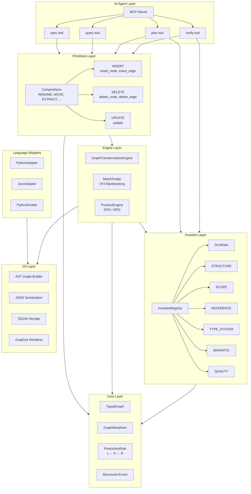
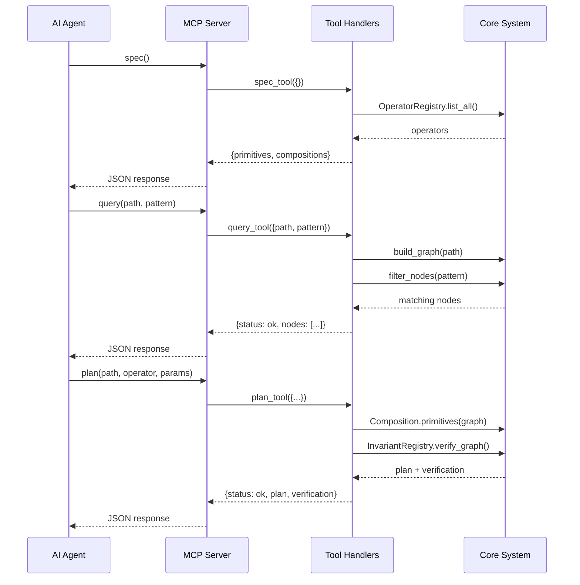
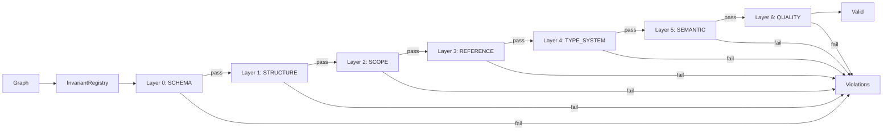
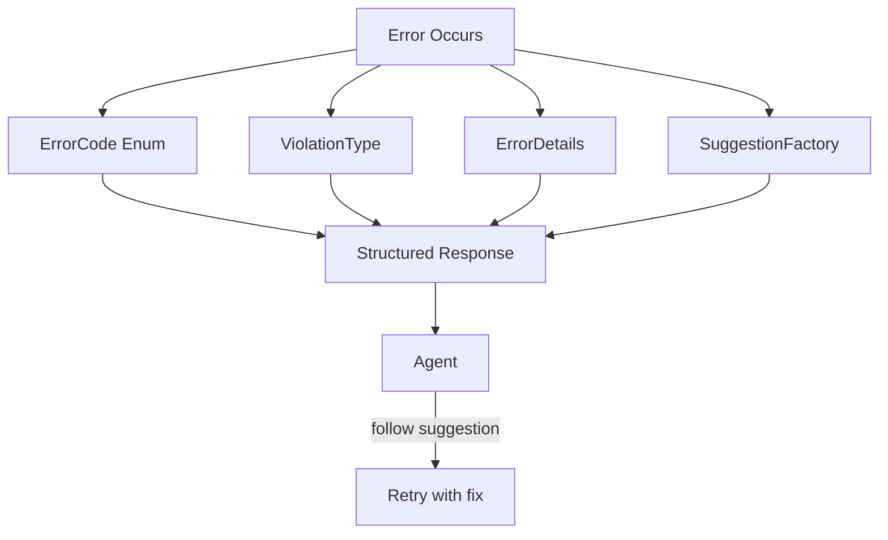
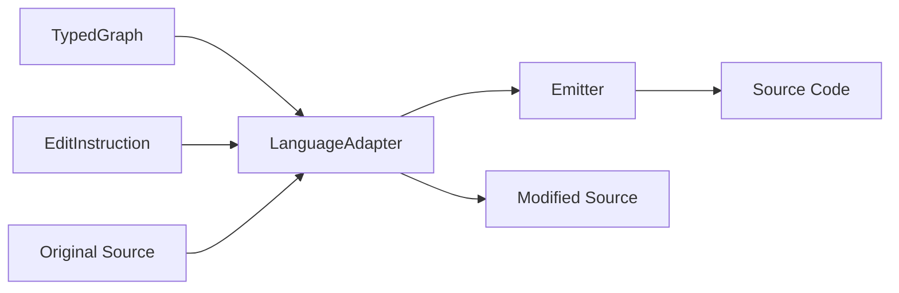

# Architecture

This document describes the internal architecture of the Graph Transformation Engine.

## System Overview



## The Three-Primitive System

All code transformations reduce to three atomic operations:

| Primitive | Operations | Purpose |
|-----------|------------|---------|
| **INSERT** | `insert_node`, `insert_edge` | Add elements to the graph |
| **DELETE** | `delete_node`, `delete_edge` | Remove elements from the graph |
| **UPDATE** | `update` | Modify properties of existing elements |

### Compositions

Higher-level refactoring operations built from primitives:

| Composition | Primitives Used | Purpose |
|-------------|-----------------|---------|
| **RENAME** | UPDATE | Rename entity and update references |
| **MOVE** | DELETE + INSERT | Move entity between scopes |
| **EXTRACT** | INSERT + UPDATE | Extract code into new entity |
| **INLINE** | DELETE + UPDATE | Inline entity into call sites |
| **ADD_GUARD** | INSERT | Add guard/check before operation |
| **CHANGE_SIGNATURE** | INSERT + DELETE + UPDATE | Modify callable signature |
| **WRAP** | INSERT | Wrap code in construct |

## MCP Server Architecture

The MCP server provides a stateless, JSON-based interface for AI agents:



### MCP Tools

| Tool | Input | Output |
|------|-------|--------|
| `spec` | `{operator?}` | Operator specs with params, preconditions, examples |
| `query` | `{path, pattern?, kind?, file?}` | Matching nodes with id, kind, name, file, line |
| `plan` | `{path, operator, params}` | Primitives, affected files, verification result |
| `verify` | `{path?, graph?, layer?}` | Validity status and violations with fix hints |

## Invariant System

The invariant system is organized into ordered verification layers:

```
Layer 0: SCHEMA     → Type graph conformance (edge types, multiplicity, attrs)
Layer 1: STRUCTURE  → Topological integrity (acyclicity, reachability)
Layer 2: SCOPE      → Name uniqueness within scopes (parametric)
Layer 3: REFERENCE  → Symbol resolution and consistency (parametric)
Layer 4: TYPE_SYSTEM → Inheritance DAG, override compatibility
Layer 5: SEMANTIC   → Argument/parameter matching
Layer 6: QUALITY    → Unused imports, empty containers, hints
```

### Key Abstractions

| Abstraction | Purpose |
|-------------|---------|
| `GraphSchema` | Declarative type graph with EdgeConstraint for edge typing and multiplicity |
| `ScopeRule` | Parametric name uniqueness rule (e.g., unique function names in class) |
| `InvariantLayer` | Enum for ordered layers with dependency-aware validation |
| `InvariantSeverity` | ERROR (blocks) / WARNING (reports) / INFO (hints) |
| `InvariantViolation` | Rich diagnostic with node, edge, related_nodes, fix_hint, layer |

### Verification Flow



## Error Handling System

Structured errors enable agent self-correction:



### Error Categories

| Category | Error Codes |
|----------|-------------|
| Input Validation | `MISSING_PATH`, `PATH_NOT_FOUND`, `UNKNOWN_OPERATOR` |
| Parse | `PARSE_ERROR`, `SYNTAX_ERROR` |
| Target Resolution | `TARGET_NOT_FOUND`, `SCOPE_NOT_FOUND` |
| Conflict | `NAME_CONFLICT`, `SCOPE_VIOLATION` |
| Graph Integrity | `DANGLING_EDGE`, `UNRESOLVED_REFERENCE`, `ORPHAN_NODE` |
| Verification | `PRECONDITION_FAILED`, `POSTCONDITION_FAILED`, `GLUING_VIOLATION` |

### Suggestion Types

| Action | When Used |
|--------|-----------|
| `verify_target` | Target not found - use query to find correct ID |
| `use_alternative_name` | Name conflict - choose different name |
| `rename_first` | Name conflict - rename existing before creating new |
| `fix_syntax` | Parse error - fix source file syntax |
| `did_you_mean` | Unknown operator - suggest similar operators |

## Module Dependency Layers

| Layer | Module | Purpose |
|-------|--------|---------|
| 1 | `core/nodes.py` | ClassNode, FieldNode, ImportNode, ModuleNode |
| 1 | `core/primitives/node_kinds.py` | NodeKind, EdgeKind enums |
| 2 | `core/typed_graph.py` | NodeType, EdgeType, GraphNode, GraphEdge, TypedGraph |
| 2 | `core/errors.py` | ErrorCode, ViolationType, SuggestionFactory |
| 3 | `core/morphism.py` | GraphMorphism (validity, injectivity, composition) |
| 4 | `core/primitives/base.py` | Primitive base, InsertNode, DeleteNode, Update |
| 4 | `core/primitives/compositions.py` | Composition classes, CompositionRegistry |
| 5 | `rewriting/production_rule.py` | ProductionRule (L ← K → R), RewriteMode |
| 5 | `rewriting/match_finder.py` | VF2-style subgraph isomorphism |
| 5 | `rewriting/pushout_engine.py` | DPO/SPO pushout construction |
| 5 | `rewriting/invariants.py` | InvariantLayer, InvariantRegistry, GraphSchema |
| 6 | `engine/transformation_path.py` | RuleApplication, TransformationPath |
| 7 | `engine/core.py` | GraphTransformationEngine |
| 8 | `io/` | builder, serialization, sqlite_storage, visualization |
| 8 | `languages/` | LanguageAdapter, PythonEmitter, registry |
| 9 | `mcp/` | MCP server and tool handlers |

## Key Abstractions

### TypedGraph

Uniform representation where all code elements are typed nodes with attribute dictionaries:

```
NodeType: FUNCTION, CLASS, FIELD, PARAMETER, CALL, ARGUMENT, IMPORT, MODULE

EdgeType: CONTAINS_METHOD, CONTAINS_FIELD, HAS_PARAMETER, HAS_ARGUMENT,
          CALLS, INHERITS, IMPORTS, DEFINED_IN, CALLER_OF, REFERENCES
```

### Node and Edge Kinds

The primitives use semantic kinds that map to internal types:

```
NodeKind: callable, type, binding, container, reference, call, access,
          block, branch, loop, literal, expression, argument, annotation

EdgeKind: contains, defines, references, calls, accesses, imports,
          inherits, implements, type_of, flows_to, depends_on,
          has_parameter, has_argument, binds_to
```

### Production Rules (L ← K → R)

For low-level DPO/SPO operations, transformations use **production rules**:
- **L** (left-hand side): pattern to match
- **K** (interface): structure preserved
- **R** (right-hand side): replacement

```
L  ←--l--  K  --r-->  R
```

- **Deleted**: nodes in L but not K
- **Created**: nodes in R but not K
- **Preserved**: nodes in K

### DPO vs SPO Rewriting

| Mode | Behavior | Use Case |
|------|----------|----------|
| **DPO** | Checks gluing condition; fails on dangling edges | Safe refactorings |
| **SPO** | Auto-removes dangling edges | Cascade deletes |

## Language Adapters

Language adapters handle code emission and format preservation:



### Adapter Interface

```python
class LanguageAdapter:
    def emit(self, graph: TypedGraph) -> str
    def emit_files(self, graph: TypedGraph, output: Path) -> dict[str, str]
    def apply_edit(self, source: str, edit: EditInstruction) -> str
```

### Edit Instructions

```python
@dataclass
class EditInstruction:
    edit_type: str  # rename, add_function, add_parameter, etc.
    file: str
    line: int | None
    column: int | None
    details: dict[str, Any]
```

## Directory Structure

```
src/graph_transform/
├── __init__.py          # Public API exports
├── core/                # Core data structures
│   ├── errors.py        # ErrorCode, ViolationType, SuggestionFactory
│   ├── morphism.py      # GraphMorphism
│   ├── nodes.py         # Extended node types
│   ├── references.py    # Reference tracking
│   ├── typed_graph.py   # TypedGraph, GraphNode, GraphEdge
│   └── primitives/      # Three-primitive system
│       ├── base.py      # Primitive classes
│       ├── compositions.py
│       ├── node_kinds.py
│       └── position.py
├── engine/              # Transformation engine
│   ├── core.py          # GraphTransformationEngine
│   └── transformation_path.py
├── io/                  # Input/Output
│   ├── builder.py       # AST → TypedGraph
│   ├── serialization.py # JSON I/O
│   ├── sqlite_storage.py
│   └── visualization.py
├── languages/           # Language adapters
│   ├── base.py          # LanguageAdapter, EditInstruction
│   ├── registry.py      # LanguageRegistry
│   ├── python/
│   │   ├── parser.py    # Python → Graph
│   │   └── emitter.py   # Graph → Python
│   └── java/
│       └── emitter.py   # Java adapter (skeleton)
├── mcp/                 # MCP server
│   ├── server.py        # MCPApp, create_app, serve
│   ├── registry.py      # OperatorRegistry
│   └── tools/           # Tool handlers
│       ├── spec.py
│       ├── query.py
│       ├── plan.py
│       └── verify.py
└── rewriting/           # Graph rewriting
    ├── graph_change.py  # GraphChangeSet tracking
    ├── invariants.py    # InvariantRegistry, GraphSchema, layers
    ├── match_finder.py  # VF2 subgraph matching
    ├── production_rule.py
    └── pushout_engine.py
```

## Storage Options

| Storage | Use Case |
|---------|----------|
| **JSON** (`serialization.py`) | Human-readable, version control friendly |
| **SQLite** (`sqlite_storage.py`) | Multiple graphs, querying, persistence |
