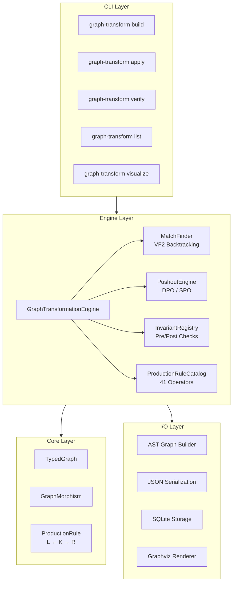
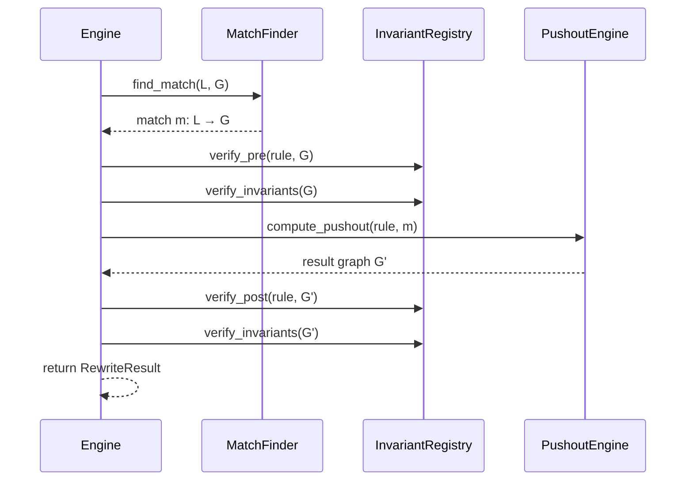

# Architecture

This document describes the internal architecture of the Graph Transformation Engine.

## System Overview



## Module Dependency Layers

| Layer | Module | Purpose |
|-------|--------|---------|
| 1 | `core/nodes.py` | ClassNode, FieldNode, ImportNode, ModuleNode |
| 1 | `operators/primitive_operators.py` | OperatorType enum (41 ops), OperatorAlgebra |
| 2 | `core/typed_graph.py` | NodeType, EdgeType, GraphNode, GraphEdge, TypedGraph |
| 3 | `core/morphism.py` | GraphMorphism (validity, injectivity, composition) |
| 4 | `rewriting/production_rule.py` | ProductionRule (L ← K → R), RewriteMode |
| 5 | `rewriting/match_finder.py` | VF2-style subgraph isomorphism |
| 5 | `rewriting/pushout_engine.py` | DPO/SPO pushout construction |
| 5 | `rewriting/invariants.py` | Invariant, InvariantRegistry |
| 6 | `operators/rule_catalog.py` | ProductionRuleCatalog (41 operator factories) |
| 6 | `engine/transformation_path.py` | RuleApplication, TransformationPath |
| 7 | `engine/core.py` | GraphTransformationEngine |
| 8 | `io/` | builder, serialization, sqlite_storage, visualization |
| 9 | `cli/` | Command-line interface |

## Key Abstractions

### TypedGraph

Uniform representation where all code elements are typed nodes with attribute dictionaries:

```
NodeType: FUNCTION, CLASS, FIELD, PARAMETER, CALL, ARGUMENT, IMPORT, MODULE

EdgeType: CONTAINS_METHOD, CONTAINS_FIELD, HAS_PARAMETER, HAS_ARGUMENT,
          CALLS, INHERITS, IMPORTS, DEFINED_IN, CALLER_OF, REFERENCES
```

### Production Rules (L ← K → R)

Each refactoring operator is encoded as a **production rule** with:
- **L** (left-hand side): pattern to match
- **K** (interface): structure preserved  
- **R** (right-hand side): replacement

```
L  ←--l--  K  --r-->  R
```

- **Deleted**: nodes in L but not K
- **Created**: nodes in R but not K  
- **Preserved**: nodes in K

### DPO vs SPO Rewriting

| Mode | Behavior | Use Case |
|------|----------|----------|
| **DPO** | Checks gluing condition; fails on dangling edges | Safe refactorings |
| **SPO** | Auto-removes dangling edges | Cascade deletes |

### Apply Rule Pipeline



## Directory Structure

```
src/graph_transform/
├── __init__.py          # Public API exports
├── cli/                 # Command-line interface
│   ├── commands/        # Individual command implementations
│   └── formatting.py    # Rich console formatting
├── core/                # Core data structures
│   ├── typed_graph.py   # TypedGraph, GraphNode, GraphEdge
│   ├── morphism.py      # GraphMorphism
│   └── nodes.py         # Extended node types
├── engine/              # Transformation engine
│   ├── core.py          # GraphTransformationEngine
│   └── transformation_path.py
├── io/                  # Input/Output
│   ├── builder.py       # AST → TypedGraph
│   ├── serialization.py # JSON I/O
│   ├── sqlite_storage.py # SQLite persistence
│   └── visualization.py # Graphviz rendering
├── operators/           # Refactoring operators
│   ├── primitive_operators.py  # OperatorType enum
│   └── rule_catalog.py  # Production rule factories
└── rewriting/           # Graph rewriting
    ├── invariants.py    # Invariant checking
    ├── match_finder.py  # VF2 subgraph matching
    ├── production_rule.py
    └── pushout_engine.py
```

## Invariant System

Built-in invariants verified before and after each rewrite:

| Invariant | Severity | Description |
|-----------|----------|-------------|
| `no_dangling_edges` | error | All edge endpoints must exist |
| `unique_function_names_in_class` | error | No duplicate method names |
| `unique_class_names_in_module` | error | No duplicate class names |
| `unique_field_names_in_class` | error | No duplicate field names |
| `valid_inheritance` | error | No circular inheritance |
| `parameter_positions_consecutive` | warning | Parameters numbered 0..n-1 |

## Storage Options

| Storage | Use Case |
|---------|----------|
| **JSON** (`serialization.py`) | Human-readable, version control friendly |
| **SQLite** (`sqlite_storage.py`) | Multiple graphs, querying, persistence |
