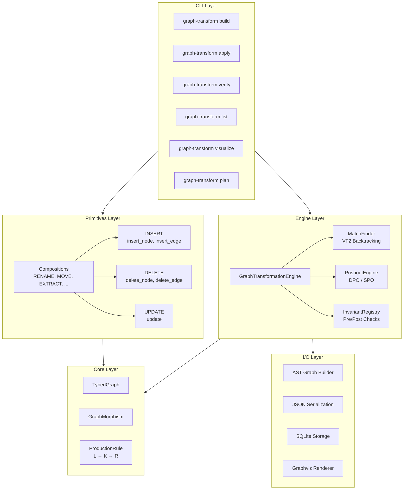
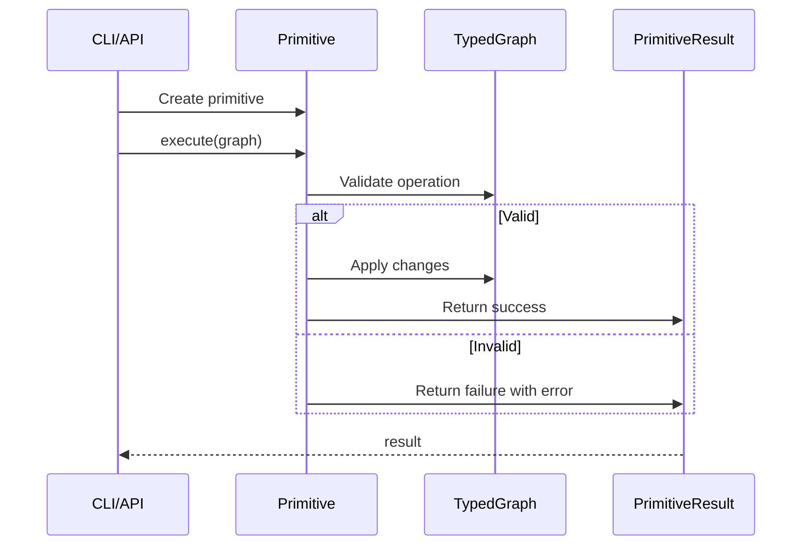
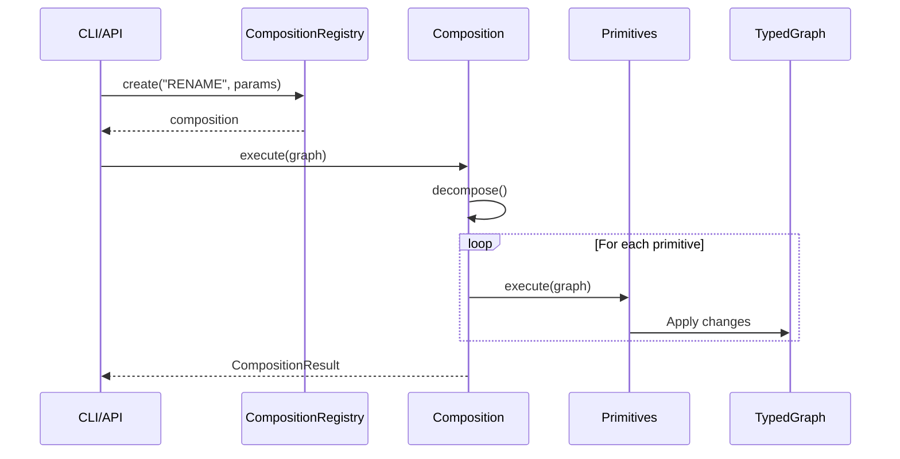

# Architecture

This document describes the internal architecture of the Graph Transformation Engine.

## System Overview



## The Three-Primitive System

All code transformations reduce to three atomic operations:

| Primitive | Operations | Purpose |
|-----------|------------|---------|
| **INSERT** | `insert_node`, `insert_edge` | Add elements to the graph |
| **DELETE** | `delete_node`, `delete_edge` | Remove elements from the graph |
| **UPDATE** | `update` | Modify properties of existing elements |

### Compositions

Higher-level refactoring operations built from primitives:

| Composition | Primitives Used | Purpose |
|-------------|-----------------|---------|
| **RENAME** | UPDATE | Rename entity and update references |
| **MOVE** | DELETE + INSERT | Move entity between scopes |
| **EXTRACT** | INSERT + UPDATE | Extract code into new entity |
| **INLINE** | DELETE + UPDATE | Inline entity into call sites |
| **ADD_GUARD** | INSERT | Add guard/check before operation |
| **CHANGE_SIGNATURE** | INSERT + DELETE + UPDATE | Modify callable signature |
| **WRAP** | INSERT | Wrap code in construct |

## Module Dependency Layers

| Layer | Module | Purpose |
|-------|--------|---------|
| 1 | `core/nodes.py` | ClassNode, FieldNode, ImportNode, ModuleNode |
| 1 | `core/primitives/node_kinds.py` | NodeKind, EdgeKind enums |
| 2 | `core/typed_graph.py` | NodeType, EdgeType, GraphNode, GraphEdge, TypedGraph |
| 3 | `core/morphism.py` | GraphMorphism (validity, injectivity, composition) |
| 4 | `core/primitives/base.py` | Primitive base, InsertNode, DeleteNode, Update |
| 4 | `core/primitives/compositions.py` | Composition classes, CompositionRegistry |
| 5 | `rewriting/production_rule.py` | ProductionRule (L ← K → R), RewriteMode |
| 5 | `rewriting/match_finder.py` | VF2-style subgraph isomorphism |
| 5 | `rewriting/pushout_engine.py` | DPO/SPO pushout construction |
| 5 | `rewriting/invariants.py` | Invariant, InvariantRegistry |
| 6 | `engine/transformation_path.py` | RuleApplication, TransformationPath |
| 7 | `engine/core.py` | GraphTransformationEngine |
| 8 | `io/` | builder, serialization, sqlite_storage, visualization |
| 9 | `cli/` | Command-line interface |

## Key Abstractions

### TypedGraph

Uniform representation where all code elements are typed nodes with attribute dictionaries:

```
NodeType: FUNCTION, CLASS, FIELD, PARAMETER, CALL, ARGUMENT, IMPORT, MODULE

EdgeType: CONTAINS_METHOD, CONTAINS_FIELD, HAS_PARAMETER, HAS_ARGUMENT,
          CALLS, INHERITS, IMPORTS, DEFINED_IN, CALLER_OF, REFERENCES
```

### Node and Edge Kinds

The primitives use semantic kinds that map to internal types:

```
NodeKind: callable, type, binding, container, reference, call, access,
          block, branch, loop, literal, expression, argument, annotation

EdgeKind: contains, defines, references, calls, accesses, imports,
          inherits, implements, type_of, flows_to, depends_on,
          has_parameter, has_argument, binds_to
```

### Production Rules (L ← K → R)

For low-level DPO/SPO operations, transformations use **production rules**:
- **L** (left-hand side): pattern to match
- **K** (interface): structure preserved
- **R** (right-hand side): replacement

```
L  ←--l--  K  --r-->  R
```

- **Deleted**: nodes in L but not K
- **Created**: nodes in R but not K
- **Preserved**: nodes in K

### DPO vs SPO Rewriting

| Mode | Behavior | Use Case |
|------|----------|----------|
| **DPO** | Checks gluing condition; fails on dangling edges | Safe refactorings |
| **SPO** | Auto-removes dangling edges | Cascade deletes |

### Primitive Execution Flow



### Composition Execution Flow



## Directory Structure

```
src/graph_transform/
├── __init__.py          # Public API exports
├── cli/                 # Command-line interface
│   ├── commands/        # Individual command implementations
│   ├── formatting.py    # Rich console formatting
│   └── primitive_metadata.py  # CLI help/validation metadata
├── core/                # Core data structures
│   ├── typed_graph.py   # TypedGraph, GraphNode, GraphEdge
│   ├── morphism.py      # GraphMorphism
│   ├── nodes.py         # Extended node types
│   └── primitives/      # Three-primitive system
│       ├── base.py      # Primitive classes
│       ├── node_kinds.py # NodeKind, EdgeKind
│       ├── position.py  # Position specification
│       └── compositions.py # Composition classes
├── engine/              # Transformation engine
│   ├── core.py          # GraphTransformationEngine
│   └── transformation_path.py
├── io/                  # Input/Output
│   ├── builder.py       # AST → TypedGraph
│   ├── serialization.py # JSON I/O
│   ├── sqlite_storage.py # SQLite persistence
│   └── visualization.py # Graphviz rendering
└── rewriting/           # Graph rewriting
    ├── invariants.py    # Invariant checking
    ├── match_finder.py  # VF2 subgraph matching
    ├── production_rule.py
    ├── graph_change.py  # GraphChangeSet tracking
    └── pushout_engine.py
```

## Invariant System

Built-in invariants verified before and after each rewrite:

| Invariant | Severity | Description |
|-----------|----------|-------------|
| `no_dangling_edges` | error | All edge endpoints must exist |
| `unique_function_names_in_class` | error | No duplicate method names |
| `unique_class_names_in_module` | error | No duplicate class names |
| `unique_field_names_in_class` | error | No duplicate field names |
| `valid_inheritance` | error | No circular inheritance |
| `parameter_positions_consecutive` | warning | Parameters numbered 0..n-1 |

## Storage Options

| Storage | Use Case |
|---------|----------|
| **JSON** (`serialization.py`) | Human-readable, version control friendly |
| **SQLite** (`sqlite_storage.py`) | Multiple graphs, querying, persistence |

## CLI Commands

| Command | Purpose |
|---------|---------|
| `build` | Parse source code into TypedGraph |
| `list` | Show available primitives and compositions |
| `apply` | Apply primitive or composition to graph |
| `batch` | Apply multiple operations from YAML |
| `plan` | Generate edit plan from source + operations |
| `dry-run` | Preview operation without applying |
| `verify` | Check graph invariants |
| `visualize` | Render graph as image |
